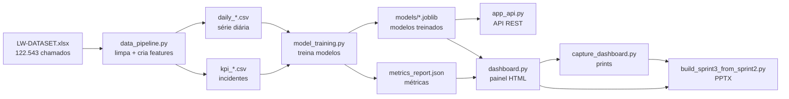

# 📘 Guia do Código — AlertOpsLite

**Para quem é este guia:** qualquer pessoa de tecnologia — inclusive **júnior** — que
queira entender **como o AlertOpsLite funciona por dentro**, do dado bruto até a API e o
painel. Cada arquivo `.py` também está **comentado linha a linha**; aqui juntamos tudo com
a explicação dos conceitos.

> **O que o projeto faz, em uma frase:** pega o histórico de chamados da Locaweb, aprende
> padrões e **prevê** (1) quantos incidentes virão nos próximos dias e (2) quais têm
> **risco de estourar a OLA** (prazo de atendimento) — servindo isso por uma **API** e um
> **painel** visual.

---

## 🗺️ Mapa dos arquivos

| Arquivo | Papel | Analogia |
|---|---|---|
| `src/data_pipeline.py` | Limpa e prepara os dados | A **cozinha** (prepara os ingredientes) |
| `src/model_training.py` | Treina e avalia os modelos de ML | A **escola** (ensina os modelos) |
| `src/app_api.py` | API que serve as previsões | O **garçom** (recebe pedidos, entrega respostas) |
| `src/dashboard.py` | Gera o painel visual (HTML + PNGs) | A **vitrine** (mostra tudo bonito) |
| `capture_dashboard.py` | Tira "prints" do painel rodando | O **fotógrafo** |
| `build_sprint3_from_sprint2.py` | Monta o PowerPoint de evidências | O **designer da apresentação** |
| `builder.py` | Roda tudo na ordem certa | O **maestro** |

---

## 🔄 Fluxo de ponta a ponta



Em texto: **dados brutos → pipeline → CSVs → treino → modelos + métricas → API e painel → prints → PPTX.**
O `builder.py` executa essa sequência com um comando só.

---

## 🧠 Conceitos essenciais (glossário para júnior)

**DataFrame (pandas):** uma tabela na memória do programa, com linhas e colunas (como uma aba do Excel). Manipulamos os dados com a biblioteca `pandas` (apelido `pd`).

**Feature (variável de entrada):** uma coluna que o modelo usa para aprender. Ex.: "dia da semana", "quantos incidentes houve ontem". **Feature engineering** = criar features úteis a partir dos dados brutos.

**Target (alvo):** o que queremos prever. Ex.: "volume de amanhã" ou "vai violar a OLA? (sim/não)".

**Lag:** o valor de uma coluna **N dias atrás**. `lag_7` = quantos incidentes houve há 7 dias. Dá "memória" ao modelo.

**Média móvel (rolling mean):** média dos últimos N dias. Suaviza o "sobe e desce" e mostra a **tendência**.

**Vazamento de dados (data leakage):** quando o modelo "espia" informação do futuro que não teria na vida real. É trapaça — infla o resultado no teste e falha em produção. Por isso usamos `.shift(1)` antes das médias (só olhar o passado).

**Regressão × Classificação:**
- **Regressão** prevê um **número** (ex.: 44 incidentes amanhã).
- **Classificação** prevê uma **categoria** (ex.: risco = Sim/Não).

**Treino e teste:** dividimos os dados. O modelo **aprende** no treino e é **avaliado** no teste (dados que ele nunca viu) — para saber se ele generaliza.

**Validação temporal:** em séries temporais **não embaralhamos**. Treinamos no passado e testamos no futuro (últimos 20% dos dias), imitando a realidade.

**Overfitting (decorar):** quando o modelo vai muito bem no treino mas mal em dados novos — decorou em vez de aprender. Controlamos com `max_depth`, `min_samples_leaf`, etc.

**Dados desbalanceados:** quando uma classe é rara. Aqui só **~1%** dos incidentes violam a OLA. Sem cuidado, o modelo "chuta tudo não" e parece ótimo. Usamos `class_weight='balanced'` para dar **mais peso** à classe rara.

**One-Hot Encoding:** modelos só entendem número. Transformamos texto (ex.: `Prioridade`) em colunas 0/1. "2 - Alta" vira uma coluna que é 1 quando é alta e 0 caso contrário.

**Pipeline (scikit-learn):** uma "esteira" que junta pré-processamento (One-Hot) + modelo num objeto só. Garante que o mesmo tratamento do treino seja aplicado na hora de prever.

**Serialização (`.joblib`):** salvar o modelo treinado em arquivo, para carregá-lo depois sem treinar de novo. É o que a API faz ao ligar.

### Métricas — como saber se o modelo é bom

**Regressão:**
- **R²** (0 a 1): quanto da variação o modelo explica. Perto de 1 = ótimo. *Nosso D+1 ≈ 0,58.*
- **MAE:** erro médio absoluto, na unidade real (incidentes/dia). *≈ 13/dia.*
- **RMSE:** parecido, mas pune mais os erros grandes.

**Classificação:**
- **Matriz de confusão:** conta acertos e erros:
  - **VP** (verdadeiro positivo): previu "vai violar" e violou ✅
  - **VN** (verdadeiro negativo): previu "não viola" e não violou ✅
  - **FP** (falso positivo): alarme falso ❌
  - **FN** (falso negativo): violação que passou batido ❌
- **Precisão:** dos que ele disse "vai violar", quantos violaram de verdade.
- **Recall:** das violações reais, quantas ele conseguiu pegar.
- **F1:** equilíbrio entre precisão e recall (bom para dados desbalanceados).
- **ROC-AUC** (0,5 a 1): capacidade de **separar** violação de não-violação. 0,5 = sorte; 1 = perfeito. *Nosso ≈ 0,82.*

### Conceitos da API

**API REST:** um "cardápio" de URLs que outros programas chamam para pedir dados/ações, via HTTP.

**Endpoint:** cada URL da API (ex.: `/api/v1/predict/ola-risk`).

**GET × POST:** `GET` = pedir/ler (ex.: health). `POST` = enviar dados para processar (ex.: mandar um incidente e receber o risco).

**JSON:** formato de texto para trocar dados (`{"chave": "valor"}`). É o que entra e sai da API.

**Pydantic:** valida os dados de entrada automaticamente. Se mandarem `hour: 99`, ele já recusa (a regra é 0–23).

**FastAPI / uvicorn / Swagger:** FastAPI é o framework da API; uvicorn é o servidor que a executa; Swagger é a página em `/docs` que permite testar a API pelo navegador.

**Docker:** empacota o app + tudo que ele precisa numa "caixa" (imagem) que roda igual em qualquer máquina (container). Evita o clássico "na minha máquina funciona".

---

## 📄 Walkthrough dos arquivos

### 1) `src/data_pipeline.py` — a cozinha dos dados
Três etapas:
1. **`load_raw_data`** — lê `data/LW-DATASET.xlsx` (a planilha da Locaweb).
2. **`clean_and_filter_data`** — converte datas, **filtra o ruído** (fica só com o que "Entrou para KPI" = 25.600 de 122.543), cria o alvo `ola_violada` (1/0) e features por incidente (`hour`, `day_of_week`, `month`, `is_weekend`).
3. **`generate_daily_aggregated_features`** — agrupa por dia, monta um calendário contínuo e cria **lags**, **médias móveis** e os **targets** `target_d1`/`target_d7`.

Saídas: `data/kpi_incidents_processed.csv` (incidentes) e `data/daily_incidents_processed.csv` (série diária).

### 2) `src/model_training.py` — a escola dos modelos
- **`train_volume_regressor`** — treina 3 regressores (Linear, Ridge, RandomForest) com **validação temporal** e escolhe o de maior R². Roda 2×: para D+1 e D+7.
- **`train_ola_classifier`** — treina 2 classificadores (DecisionTree, RandomForest) com `class_weight='balanced'` (dados desbalanceados) e escolhe o de maior F1. Usa um **Pipeline** com One-Hot Encoding.
- **`recursive_forecast`** — prevê 7 dias em cadeia: prevê amanhã, usa essa previsão para prever depois de amanhã, e assim por diante.
- **`run_training`** — salva os 3 modelos `.joblib`, o `metadata.json` (features, histórico, limiares de risco P70/P90) e o `metrics_report.json` (todas as métricas + os KPIs do painel).

### 3) `src/app_api.py` — o garçom (API)
- No **startup** (`lifespan`) carrega os modelos **uma vez** na memória.
- **Schemas Pydantic** definem e validam a entrada/saída de cada endpoint.
- Endpoints: `/health` (saúde), `/metrics` (métricas), `/predict/volume` (previsão de volume), `/predict/ola-risk` (risco de OLA → `Baixo/Médio/Alto` pelos limiares P70/P90).
- Rode com `uvicorn src.app_api:app --reload` e teste em `http://127.0.0.1:8000/docs`.

### 4) `src/dashboard.py` — a vitrine
Monta gráficos com **Plotly** na paleta do projeto e gera:
- 5 PNGs de evidência (série + projeção, Pareto, matriz de risco, matriz de confusão, qualidade dos modelos);
- o **`dashboard.html`** interativo e **didático**: onboarding "Como usar", KPIs com tooltip e, em cada gráfico, um ícone **ⓘ** que explica *O que é / De onde vem / Como ler / O que você tira daqui*;
- uma seção **"Contexto & Qualidade dos Dados"** (funil 122k→25,6k e sazonalidade por dia da semana).

### 5) `capture_dashboard.py` — o fotógrafo
Abre o `dashboard.html` num navegador **headless** (Chrome/Edge, sem janela) e recorta 3 imagens (com Pillow) usadas como **amostra de execução** no PPTX. Se não houver navegador, o passo é pulado sem quebrar o build.

### 6) `build_sprint3_from_sprint2.py` — o designer
Cria o PPTX da Sprint 3 como **cópia exata** do template da Sprint 2 (mesmo tema/fontes/ícones), troca os slides ilustrativos por **evidência real** e **adiciona slides** de evidência de construção (código, painel em execução, GitHub, API, Docker).

### 7) `builder.py` — o maestro
Executa, em ordem: `data_pipeline` → `model_training` → `dashboard` → `capture_dashboard` → `build_sprint3_from_sprint2`. Um comando regenera **tudo**.

---

## ▶️ Como rodar

```bash
pip install -r requirements.txt   # instala as dependências (Python 3.12)
python builder.py                 # roda o pipeline completo
uvicorn src.app_api:app --reload  # sobe a API (Swagger em /docs)
```

Com Docker (a imagem treina os modelos e sobe a API):

```bash
docker build -t alertopslite:sprint3 .
docker run --rm -p 8000:8000 alertopslite:sprint3
```

---

## 📊 Resultados esperados (validação)

| Modelo | Métrica | Valor |
|---|---|---|
| Volume D+1 | R² · MAE | ~0,58 · ~13/dia |
| Volume D+7 | R² | ~0,54 |
| Risco de OLA | ROC-AUC · Recall | ~0,82 · ~0,29 |

- **122.543** chamados → **25.600** elegíveis (≈79% eram ruído de monitoramento).
- **248** violações de OLA (**0,97%**) — daí o cuidado com dados desbalanceados.

---

## ❓ FAQ do júnior

**Por que jogar fora 79% dos dados?** Porque são alertas automáticos "Sem Intervenção" — não representam trabalho humano nem contam para o KPI. Manter isso enviesaria a análise.

**Por que 3 modelos de regressão?** Para **comparar** e escolher o melhor com base em métrica objetiva (R²), em vez de "achismo".

**Por que o Recall do risco é baixo (~0,29)?** Violação é rara (~1%) e usamos poucas features de abertura. Para um MVP, o **ROC-AUC de 0,82** já mostra que o modelo **ordena bem** o risco — a calibração fina fica para a Sprint 4.

**Onde mudo a URL do repositório no slide do GitHub?** Na constante `REPO_URL` do `build_sprint3_from_sprint2.py`.

**"Na minha máquina não roda o print do dashboard."** O `capture_dashboard.py` precisa de Chrome/Edge. Sem eles, o passo é pulado e o PPTX usa as imagens já existentes.
